# Animation effects

[Installation and configuration](../README.md#install)

| Preview | Effect | Description |
| --- | --- | --- |
| 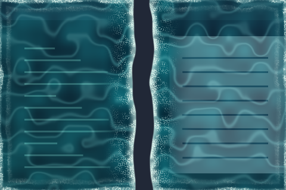 | [beach-surf-animation](beach-surf-animation/) | A water-and-foam window reveal and disappearance. |
| 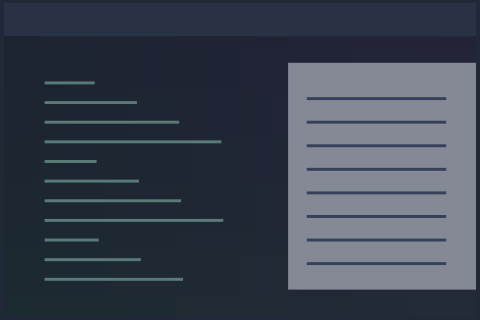 | [example](example/) | A minimal opening effect that fades the window in while scaling from 96% to full size. |
|  | [paper-animation](paper-animation/) | A sheet falls and unfurls on opening, then scrunches and falls away on closing. |
| 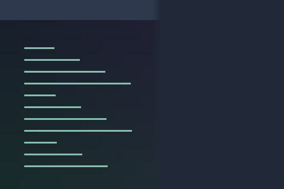 | [reveal](reveal/) | A bundled opening and closing reveal animation. |
|  | [squash](squash/) | A bundled squash deformation for window movement. |
| 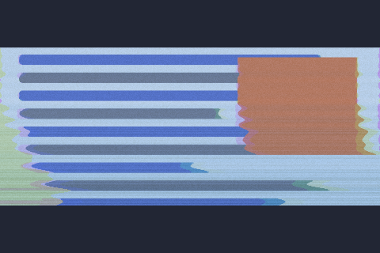 | [tv-glitch](tv-glitch/) | A CRT switching on and off: glitching noise bands, then a collapse to a line and a dot. Ported from Burn-My-Windows. |
| 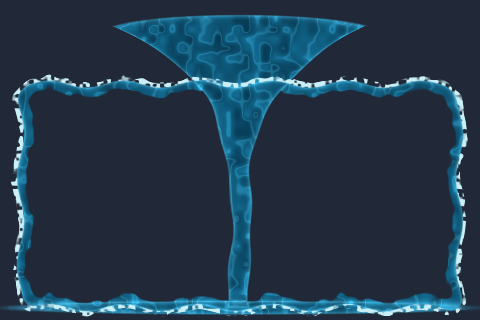 | [water-conjure](water-conjure/) | A drop lands, a water column rises, and a foamy frame fills inward; closing reverses into a puddle. |
| 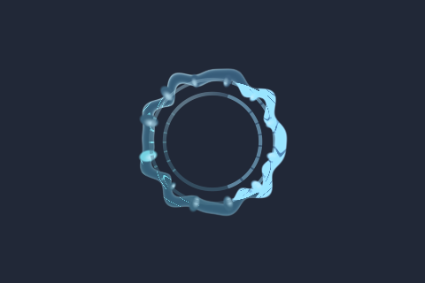 | [water-splash](water-splash/) | A water-drop impact seen from above, intended for closing windows. |
|  | [wobbly-lifecycle](wobbly-lifecycle/) | Elastic-sheet deformation for opening and closing windows. |
|  | [wobbly-move](wobbly-move/) | Elastic deformation during animated moves, resizes, and layout changes. |
| 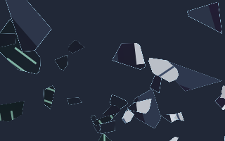 | [shattered-glass](shattered-glass/) | Opening reassembles an irregular fracture map. Closing breaks the window into 41 unequal polygonal shards, with clustered small splinters, large fragments, independent release delays, tumbling, launch velocities, and gravity. |
| 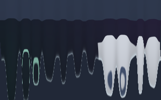 | [wet-paint](wet-paint/) | Opening pours long, uneven paint streams down the window. Closing slowly drains the window in elongated drips, stretching its content through a broad glossy wet region. |
| 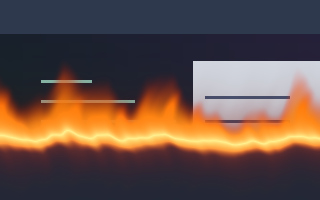 | [flame-grilled](flame-grilled/) | Opening sweeps tall, rolling flames downward and leaves the window behind. Closing burns slowly upward, consuming the window under a broad orange and yellow flame body. |
| 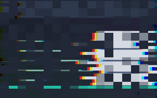 | [glitch](glitch/) | Opening vibrates the window into existence through displaced digital bands, staggered blocks, and RGB separation. Closing glitches those blocks out of existence. |
| 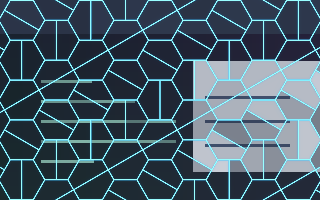 | [cells](cells/) | Opening traces glowing pentagonal lines outward from the centre, fills the cells with the window, then withdraws the lines from the perimeter back to the centre. Closing traces the same lines, empties the cells, and retracts the grid inward. |
| 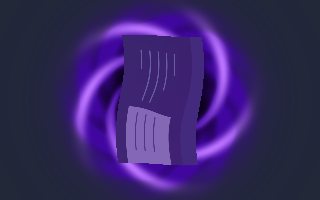 | [void](void/) | Opening grows a broad violet vortex around a black core and releases the twisting window. Closing winds the window into the darkness, with luminous ribbons continuously spiralling inward before the portal seals. |
|  | [old-tv](old-tv/) | Closing collapses the picture into a horizontal phosphor line, then a brighter central blink that lingers before winking out. Opening reverses the slower line-and-afterimage sequence. |
| 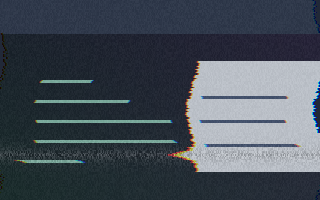 | [vhs](vhs/) | Opening introduces the window through horizontal tape stretch, rolling tracking errors, scanlines, noise, and colour bleed. Closing stretches and distorts the picture as it disappears. |
| 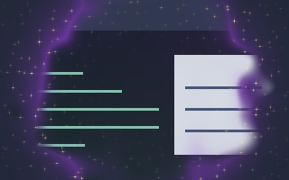 | [magic](magic/) | Opening reveals the window from a violet puff surrounded by drifting golden four-point sparkles. Closing dissolves the window into the puff and sparkling dust. |
|  | [triangle-flaps](triangle-flaps/) | Equilateral triangles point alternately up and down. Each independently traces its outline at a random time, then unfolds downward under acceleration to reveal the window. On closing, the triangles hinge downward, fall, and fade at different times. |
| 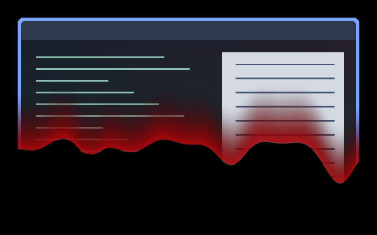 | [Blood In](blood-in/) | Wave of blood reveals the window top to bottom. |
| 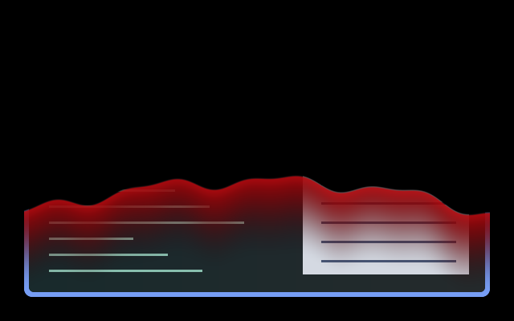 | [Blood Out](blood-out/) | Drains out the bottom with same wave as Blood In. |
| 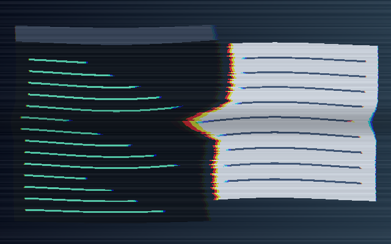 | [workspace-transation-vhs-ripple](workspace-transation-vhs-ripple/) | Strong VHS tracking distortion and ripples over the native workspace slide. |
|  | [kzzzt-open](kzzzt-open/) | Opening strikes the window into being with one overexposed, torn frame, then it stutters in through displaced bands and phosphor bloom while circuit traces flare at its edges and settle. |
| 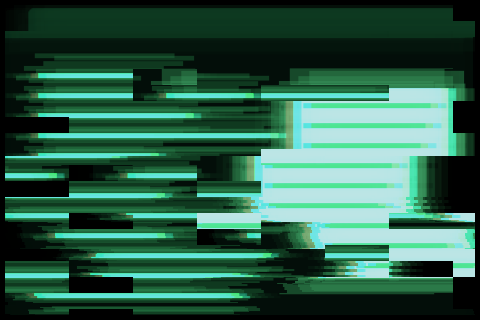 | [kzzzt-close](kzzzt-close/) | Closing overdrives the window’s own colours into phosphor and tears it into bands, then blows it out like a fuse, with one overexposed pop and a short fading afterglow. |
| 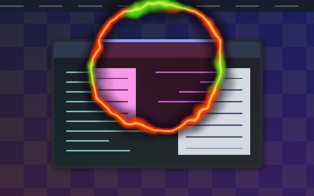 | [witching-hour](witching-hour/) | A ragged orange-and-green fire portal reveals the entire next scene, including wallpaper and shell surfaces. Requires the full-scene workspace reveal API. |
