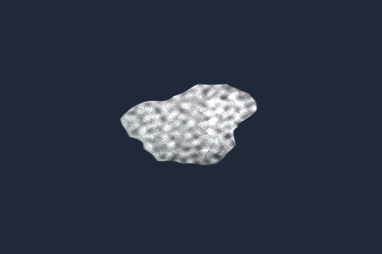

# Paper Animation

A sheet falls and unfurls on opening, then scrunches and falls away on closing.



Preview rendered from this shader over a synthetic desktop sample; it is not a screenshot of a running session. It shows an intermediate frame, not the complete animation.

## Use

Follow the [installation instructions](../../README.md#install), then merge this into `~/.config/umbriel/config.toml`:

```toml
[include]
files = ["shaders/community/animation/paper-animation/effect.toml"]

[animation]
enabled = true

[animation.windows_in]
enabled = true
effect = "paper-animation"
duration_ms = 1350
curve = "linear"

[animation.windows_out]
enabled = true
effect = "paper-animation"
duration_ms = 1150
curve = "linear"
```

Append the include path to your existing `files` array and merge selectors into existing tables. Including `effect.toml` defines the preset; the selector enables it. [`config.toml`](config.toml) contains the same copyable example.

Animation selectors are global for the chosen event; per-application animation assignment is not available in this API. Adjust `duration_ms` to change the timing.

## Colours and tuning

Colours are defined in `shader.glsl`. Setting `palette = true` alone will not recolour a shader that does not read the palette. Edit its colour constants to customise it.

## Compatibility and cost

Requires Umbriel with the preset effects API introduced in [`512e2fb3`](https://github.com/noctalia-dev/umbriel/commit/512e2fb3). See [validation and limitations](../../VALIDATION.md). No previous-frame feedback buffers are used. It runs while the selected transition is active. The shader contains loops; performance depends on your GPU and the affected area. No performance benchmark is claimed.

## Attribution

Author/contributor: Barrulus. License: [MIT](../../LICENSES/Barrulus-MIT.txt).

Contributed by Barrulus on 2026-09-27.
