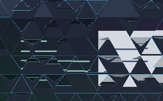

# Triangle Flaps

Equilateral triangles point alternately up and down. Each independently traces its outline at a random time, then unfolds downward under acceleration to reveal the window. On closing, the triangles hinge downward, fall, and fade at different times.



Synthetic shader render at 55% of opening, not a compositor screenshot. Explore both directions and scrub the timeline in the [interactive preview](../../preview/).

## Use

Save [effect.toml](effect.toml) and [shader.glsl](shader.glsl) together in `~/.config/umbriel/shaders/community/animation/triangle-flaps/`, keeping the [MIT license](../../LICENSES/Barrulus-MIT.txt). Merge [config.toml](config.toml) into your Umbriel configuration:

```toml
[include]
files = ["shaders/community/animation/triangle-flaps/effect.toml"]

[animation]
enabled = true

[animation.windows_in]
enabled = true
effect = "triangle-flaps"
duration_ms = 1300
curve = "linear"

[animation.windows_out]
enabled = true
effect = "triangle-flaps"
duration_ms = 1200
curve = "linear"
```

Append the include path to an existing `files` array and merge existing tables; do not duplicate them. Including the preset registers it; the two selectors activate the opening/closing pair. Animation selection is global per event.

## Configuration options

Edit the existing `[effects.preset."triangle-flaps"]` table in [effect.toml](effect.toml).
The [complete configuration reference](../../README.md#configuration-reference) explains
selection, overrides, and accepted ranges. The values below are this preset's shipped
settings, including defaults for omitted keys.

| TOML setting | Shipped value | What changing it does |
| --- | --- | --- |
| `kind` | `"animation"` | Keep this kind: the source implements its `animation` entry point. |
| `shader` | `"shader.glsl"` | Loads the source beside this preset; change the path only when using another compatible source. |
| `palette` | `false` | This source does not read the palette; enabling it alone does not recolour the effect. |

Edit the event tables in your main Umbriel configuration (the activation
example is [config.toml](config.toml)). Larger `duration_ms` gives a slower
transition. Both `[animation] enabled` and the event must be enabled.

| Event | Example duration | Example curve |
| --- | --- | --- |
| `[animation.windows_in]` | `1300` ms | `"linear"` |
| `[animation.windows_out]` | `1200` ms | `"linear"` |

Use `effect = ""` to clear the custom selection or event `enabled = false`
to disable the transition. Spring curves choose their own duration.
This shader uses linear progress: changing easing does not reshape its internal phases.
Opening/closing `style` and `scale` do not tune a working custom shader.
There is no animation-preset TOML `speed`; use event timing.

### Shader controls

Edit these values in [shader.glsl](shader.glsl), not in TOML. `#define` is
active GLSL code; comments use `//` or `/* ... */`. Start with small changes
and keep paired shaders in sync. Keep size and duration divisors positive.

| GLSL control or expression | Shipped value | Visual effect |
| --- | --- | --- |
| `TILE_SIZE` | `85.0` | Triangle side length in logical pixels; larger gives fewer, bigger flaps. Try 55–140. |

Save and reload; see [reloading edits](../../README.md#reloading-edits).

### Additional tuning notes

Edit `TILE_SIZE` for equilateral side length in logical pixels; try 55–140 (default 85). Each triangle starts independently within the first 43% of the timeline, then takes another 40–52% to complete its motion. Colours are defined in the shader; this preset does not read the theme palette.

## Compatibility and cost

Targets `animation.windows_in` and `animation.windows_out` with the Umbriel preset effects API and GLSL ES 1.00. Both visible endpoints return the original premultiplied sample; both hidden endpoints return transparent black. No previous-frame feedback or extra textures are used.

Up to 18 candidate triangles per fragment, with inverse perspective projection, trigonometry, and a texture sample only for covering flaps. No hardware performance benchmark is claimed.

Flaps rotate about horizontal upper hinges with perspective foreshortening. Neighboring triangles are checked so closing flaps can fall below their original cells. Outlines add colour over transparent regions. Settled tiles return seamless window content.

See the [paired-transition validation report](../../VALIDATION.md#paired-window-transitions) for tested revisions, compilation, endpoint checks, and remaining runtime limitations.

## Attribution

Author/contributor: Barrulus, with Codex assistance. Original implementation for this collection, 2026-09-29. License: [MIT](../../LICENSES/Barrulus-MIT.txt).
