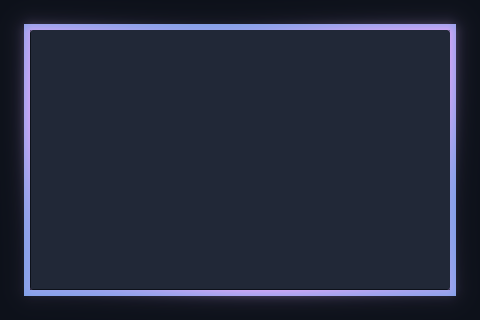

# Accent Pulse

A soft pulse travels around the focused border, tinted by the theme accent.



Preview rendered from this shader over a synthetic desktop sample; it is not a screenshot of a running session. It shows the outer shader only; paired inner overlays and compositor light are not shown.

## Use

Follow the [installation instructions](../../README.md#install), then merge this into `~/.config/umbriel/config.toml`:

```toml
[include]
files = ["shaders/community/border/accent-pulse/effect.toml"]

[effects]
border = "accent-pulse"
```

Append the include path to your existing `files` array and merge selectors into existing tables. Including `effect.toml` defines the preset; the selector enables it. [`config.toml`](config.toml) contains the same copyable example.

Borders apply to the focused, decorated window. Fullscreen and urgent windows do not display the border effect.

## Colours and tuning

This preset enables the theme palette. Edit `[colors]` to change the supplied colours; see [theme colours](../../README.md#theme-colours).

## Compatibility and cost

Requires upstream Umbriel with the preset effects API introduced in [`512e2fb3`](https://github.com/noctalia-dev/umbriel/commit/512e2fb3). See [validation and limitations](../../VALIDATION.md). No previous-frame feedback buffers are used. This adds a focused-border pass plus compositor light and blur. No performance benchmark is claimed.

## Attribution

Author/contributor: Noctalia. License: [MIT](../../LICENSES/Noctalia-MIT.txt).

Copied from [Umbriel’s bundled pulse preset](https://github.com/noctalia-dev/umbriel/tree/c3d0eaafb1e31ee0abd99b547f85b5d52a28d0c7/examples/effects/border/pulse).
The preset is named `accent-pulse` here to distinguish it from Barrulus’s cyan `pulse`.
