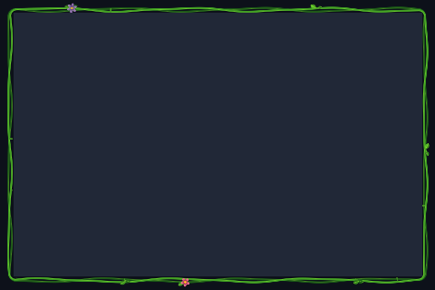

# Flowering Vine

Intertwined vines, opening flowers, and drifting blooms around the focused window.



Preview rendered from this shader over a synthetic desktop sample; it is not a screenshot of a running session. It shows the outer shader only; paired inner overlays and compositor light are not shown.

## Use

Download [effect.toml](effect.toml) and [shader.glsl](shader.glsl) using GitHub’s **Download raw file** button and save them together in `~/.config/umbriel/shaders/community/border/flowering-vine/`. Keep the license notice linked below with your files. See [installation](../../README.md#install) for details.

Also download the companion [effect.toml](../../window/flowering-vine-overlay/effect.toml) and [shader.glsl](../../window/flowering-vine-overlay/shader.glsl) into `~/.config/umbriel/shaders/community/window/flowering-vine-overlay/`. This preset includes those files automatically.

Then merge this into `~/.config/umbriel/config.toml`:

```toml
[include]
files = ["shaders/community/border/flowering-vine/effect.toml"]

[effects]
border = "flowering-vine"
```

Append the include path to your existing `files` array and merge selectors into existing tables. Including `effect.toml` defines the preset; the selector enables it. [`config.toml`](config.toml) contains the same copyable example.

The [flowering-vine-overlay](../../window/flowering-vine-overlay/) follows the focused border; it is not applied to every window.

Borders apply to the focused, decorated window. Fullscreen and urgent windows do not display the border effect. The `ring_padding` constant in the shader must match `padding` in `effect.toml`.

## Configuration options

Edit the existing `[effects.preset."flowering-vine"]` table in [effect.toml](effect.toml).
The [complete configuration reference](../../README.md#configuration-reference) explains
selection, overrides, and accepted ranges. The values below are this preset's shipped
settings, including defaults for omitted keys.

| TOML setting | Shipped value | What changing it does |
| --- | --- | --- |
| `kind` | `"border"` | Keep this kind: the source implements its `border` entry point. |
| `shader` | `"shader.glsl"` | Loads the source beside this preset; change the path only when using another compatible source. |
| `palette` | `false` | This source does not read the palette; enabling it alone does not recolour the effect. |
| `padding` | `8` | Logical pixels of extra outward drawing space. Keep GLSL `ring_padding` equal to it. Reducing it can clip artwork; it is not a painted-width control. |
| `speed` | `1` | Time multiplier: 0.5 halves speed, 2 doubles it, 0 freezes at time zero. Also controls an attached overlay. |
| `animated` | `true` | Set false to freeze this border and its attached overlay at time zero. |
| `overlay` | `"flowering-vine-overlay"` | Remove this key or use an empty string for the outer decoration only; see below. |

The optional `[effects.preset."flowering-vine".light]` subtable is enabled in this preset.
Adding it enables light; removing the whole table disables it. Shader-painted glow is separate.

| Light setting | Shipped value | What changing it does |
| --- | --- | --- |
| `spread` | `16` | Logical-pixel reach; larger spreads light farther. |
| `intensity` | `0.25` | Brightness; lower is dimmer, 0 makes the light invisible. |
| `threshold` | `0.75` | Raise to emit only from brighter ring pixels; lower to include dimmer pixels. |

### Keep only the outer border

To remove the artwork over window content, remove `overlay = "flowering-vine-overlay"`
from this preset (or set `overlay = ""`). Remove the companion path from
`[include].files` too if nothing else needs it; delete the empty include table
if appropriate. Keep the shader and its padding unchanged. Do not break an
include path or invent an overlay name to disable it. A separately selected
window effect remains independent.

When keeping the [flowering-vine-overlay companion](../../window/flowering-vine-overlay/), edit shared artwork
controls in both shaders so they meet at the window edge. Use the border's
`speed` and `animated` settings for their shared clock. See
[copying and narrowing border effects](../../README.md#border-width-padding-and-overlays).

### Shader controls

Edit these values in [shader.glsl](shader.glsl), not in TOML. `#define` is
active GLSL code; comments use `//` or `/* ... */`. Start with small changes
and keep paired shaders in sync. Keep size and duration divisors positive.

| GLSL control or expression | Shipped value | Visual effect |
| --- | --- | --- |
| `VINE_SPEED` | `0.75` | Multiplier for vine animation; larger positive values grow and move faster. |
| `GROWTH_SECONDS` | `13.0` | Base growth-cycle duration in shader seconds, with up to 7 extra random seconds; larger slows the cycle. VINE_SPEED and border speed also scale timing. |
| `SPROUT_SPACING` | `88.0` | Distance between sprouts in logical pixels; larger gives fewer sprouts. |
| `BLOOM_DRIFT` | `18.0` | Bloom travel speed along the vine in logical pixels per shader second. |
| `VINE_OUTSET` | `12.0` | Maximum outward reach in logical pixels; lower confines growth closer to the window. Drawing space still limits it. |
| `VINE_INSET` | `24.0` | Maximum inward reach in logical pixels; lower confines growth closer to the content edge. |

Save and reload; see [reloading edits](../../README.md#reloading-edits).

## Compatibility and cost

Requires Umbriel with the preset effects API introduced in [`512e2fb3`](https://github.com/noctalia-dev/umbriel/commit/512e2fb3). See [validation and limitations](../../VALIDATION.md). No previous-frame feedback buffers are used. This adds a focused-border pass plus compositor light and blur. The shader contains loops; performance depends on your GPU and the affected area. No performance benchmark is claimed.

## Attribution

Author/contributor: Barrulus. License: [MIT](../../LICENSES/Barrulus-MIT.txt).

Contributed by Barrulus on 2026-09-27.
