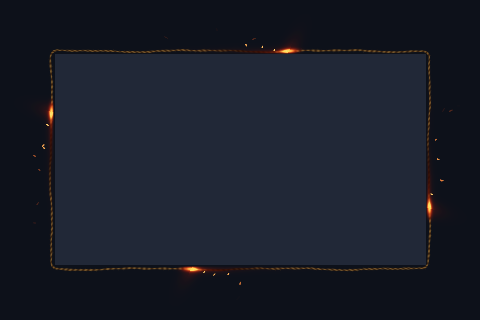

# Fuse

A braided fuse with travelling embers, ash, and sparks.



Preview rendered from this shader over a synthetic desktop sample; it is not a screenshot of a running session. It shows the outer shader only; paired inner overlays and compositor light are not shown.

## Use

Download [effect.toml](effect.toml) and [shader.glsl](shader.glsl) using GitHub’s **Download raw file** button and save them together in `~/.config/umbriel/shaders/community/border/fuse/`. Keep the license notice linked below with your files. See [installation](../../README.md#install) for details.

Then merge this into `~/.config/umbriel/config.toml`:

```toml
[include]
files = ["shaders/community/border/fuse/effect.toml"]

[effects]
border = "fuse"
```

Append the include path to your existing `files` array and merge selectors into existing tables. Including `effect.toml` defines the preset; the selector enables it. [`config.toml`](config.toml) contains the same copyable example.

Borders apply to the focused, decorated window. Fullscreen and urgent windows do not display the border effect. The `ring_padding` constant in the shader must match `padding` in `effect.toml`.

## Configuration options

Edit the existing `[effects.preset."fuse"]` table in [effect.toml](effect.toml).
The [complete configuration reference](../../README.md#configuration-reference) explains
selection, overrides, and accepted ranges. The values below are this preset's shipped
settings, including defaults for omitted keys.

| TOML setting | Shipped value | What changing it does |
| --- | --- | --- |
| `kind` | `"border"` | Keep this kind: the source implements its `border` entry point. |
| `shader` | `"shader.glsl"` | Loads the source beside this preset; change the path only when using another compatible source. |
| `palette` | `false` | This source does not read the palette; enabling it alone does not recolour the effect. |
| `padding` | `48` | Logical pixels of extra outward drawing space. Keep GLSL `ring_padding` equal to it. Reducing it can clip artwork; it is not a painted-width control. |
| `speed` | `1` | Time multiplier: 0.5 halves speed, 2 doubles it, 0 freezes at time zero. Also controls an attached overlay. |
| `animated` | `true` | Set false to freeze this border and its attached overlay at time zero. |
| `overlay` | `""` | No inward pass is attached. A compatible window preset can be attached by name. |

The optional `[effects.preset."fuse".light]` subtable is enabled in this preset.
Adding it enables light; removing the whole table disables it. Shader-painted glow is separate.

| Light setting | Shipped value | What changing it does |
| --- | --- | --- |
| `spread` | `90` | Logical-pixel reach; larger spreads light farther. |
| `intensity` | `1.4` | Brightness; lower is dimmer, 0 makes the light invisible. |
| `threshold` | `0.5` | Raise to emit only from brighter ring pixels; lower to include dimmer pixels. |

### Shader controls

Edit these values in [shader.glsl](shader.glsl), not in TOML. `#define` is
active GLSL code; comments use `//` or `/* ... */`. Start with small changes
and keep paired shaders in sync. Keep size and duration divisors positive.

| GLSL control or expression | Shipped value | Visual effect |
| --- | --- | --- |
| `EMBER_COUNT` | `4` | Number of travelling ember heads. Use a positive integer with no fixed upper cap; zero or negative disables the effect. Each head has its own spark emitter, so higher counts add rendering work. |
| `FUSE_SECONDS` | `10.0` | Time for a fuse cycle in shader seconds; larger makes a slower circuit. |
| `FUSE_BRIGHTNESS` | `1.0` | Ember brightness multiplier; lower dims it. |
| `FUSE_WANDER` | `1.0` | Sideways wandering amplitude, clamped to 0–1; lower keeps embers closer to the ring path. |

Save and reload; see [reloading edits](../../README.md#reloading-edits).

## Compatibility and cost

The former four-ember cap has been removed, including the separate spark-emitter
loop limit. Counts through 16 were checked offscreen against upstream main's
GLES wrapper; see the [count validation report](../../VALIDATION.md#documentation-cleanup-and-border-counts-2026-10-01).
Higher counts add spark work and can make the tips and trails overlap.

Requires Umbriel with the preset effects API introduced in [`512e2fb3`](https://github.com/noctalia-dev/umbriel/commit/512e2fb3). See [validation and limitations](../../VALIDATION.md). No previous-frame feedback buffers are used. This adds a focused-border pass plus compositor light and blur. The shader contains loops; performance depends on your GPU and the affected area. No performance benchmark is claimed.

## Attribution

Author/contributor: Barrulus. License: [MIT](../../LICENSES/Barrulus-MIT.txt).

Contributed by Barrulus on 2026-09-27.
