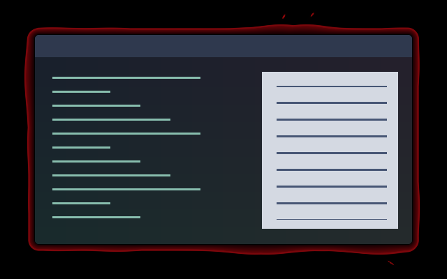

# Heartbeat

Viscous border with heartbeat. Companion to [Blood In](../../animation/blood-in/) and [Blood Out](../../animation/blood-out/)



Preview rendered from this shader over a synthetic desktop sample; it is not a screenshot of a running session. It shows the outer shader only; paired inner overlays and compositor light are not shown.

## Use

Download [effect.toml](effect.toml) and [shader.glsl](shader.glsl) using GitHub’s **Download raw file** button and save them together in `~/.config/umbriel/shaders/community/border/heartbeat/`. Keep the license notice linked below with your files. See [installation](../../README.md#install) for details.

Then merge this into `~/.config/umbriel/config.toml`:

```toml
[include]
files = ["shaders/community/border/heartbeat/effect.toml"]

[effects]
border = "heartbeat"

```

Append the include path to your existing `files` array and merge selectors into existing tables. Including `effect.toml` defines the preset; the selector enables it. [`config.toml`](config.toml) contains the same copyable example.

## Testing

Tested on Umbriel [`6adcbc043c74`](https://github.com/noctalia-dev/umbriel/commit/6adcbc043c74) with NVIDIA and Intel GPUs.

## Compatibility and cost
Requires Umbriel with the preset effects API introduced in [`512e2fb3`](https://github.com/noctalia-dev/umbriel/commit/512e2fb3). See [validation and limitations](../../VALIDATION.md). The shader contains loops; performance depends on your GPU and the affected area. No performance benchmark is claimed.

## Attribution

Adapted from [Flowing Water](../flowing-water/) by Barrulus License: 

[MIT](../../LICENSES/Barrulus-MIT.txt). 

Author/contributor: WinterMyst. 

License: 

MIT License

Copyright (c) 2026 WinterMyst

Permission is hereby granted, free of charge, to any person obtaining a copy
of this software and associated documentation files (the "Software"), to deal
in the Software without restriction, including without limitation the rights
to use, copy, modify, merge, publish, distribute, sublicense, and/or sell
copies of the Software, and to permit persons to whom the Software is
furnished to do so, subject to the following conditions:

The above copyright notice and this permission notice shall be included in all
copies or substantial portions of the Software.

THE SOFTWARE IS PROVIDED "AS IS", WITHOUT WARRANTY OF ANY KIND, EXPRESS OR
IMPLIED, INCLUDING BUT NOT LIMITED TO THE WARRANTIES OF MERCHANTABILITY,
FITNESS FOR A PARTICULAR PURPOSE AND NONINFRINGEMENT. IN NO EVENT SHALL THE
AUTHORS OR COPYRIGHT HOLDERS BE LIABLE FOR ANY CLAIM, DAMAGES OR OTHER
LIABILITY, WHETHER IN AN ACTION OF CONTRACT, TORT OR OTHERWISE, ARISING FROM,
OUT OF OR IN CONNECTION WITH THE SOFTWARE OR THE USE OR OTHER DEALINGS IN THE
SOFTWARE.


Contributed by WinterMyst on 2026-10-05.
