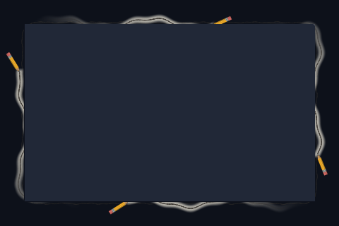

# Paper

Four pencils draw graphite around a paper-like window perimeter.



Preview rendered from this shader over a synthetic desktop sample; it is not a screenshot of a running session. It shows the outer shader only; paired inner overlays and compositor light are not shown.

## Use

Download [effect.toml](effect.toml) and [shader.glsl](shader.glsl) using GitHub’s **Download raw file** button and save them together in `~/.config/umbriel/shaders/community/border/paper/`. Keep the license notice linked below with your files. See [installation](../../README.md#install) for details.

Also download the companion [effect.toml](../../window/paper-overlay/effect.toml) and [shader.glsl](../../window/paper-overlay/shader.glsl) into `~/.config/umbriel/shaders/community/window/paper-overlay/`. This preset includes those files automatically.

Then merge this into `~/.config/umbriel/config.toml`:

```toml
[include]
files = ["shaders/community/border/paper/effect.toml"]

[effects]
border = "paper"
```

Append the include path to your existing `files` array and merge selectors into existing tables. Including `effect.toml` defines the preset; the selector enables it. [`config.toml`](config.toml) contains the same copyable example.

The [paper-overlay](../../window/paper-overlay/) follows the focused border; it is not applied to every window.

Borders apply to the focused, decorated window. Fullscreen and urgent windows do not display the border effect. The `ring_padding` constant in the shader must match `padding` in `effect.toml`.

For paper-textured content, also include [paper-content](../../window/paper-content/). The [paper animation](../../animation/paper-animation/) is a separate optional global selection.

## Theme palette

This preset enables `palette = true` in `effect.toml`. Artwork colours follow
Umbriel's `[colors]` accents, warning, and error colours, while retaining shading
and highlights. Set `palette = false` in that preset to restore the original
colours shown in the preview. For a border with a companion overlay, change
both presets together. Shader colour constants are the fallback colours.

## Configuration options

Edit the existing `[effects.preset."paper"]` table in [effect.toml](effect.toml).
The [complete configuration reference](../../README.md#configuration-reference) explains
selection, overrides, and accepted ranges. The values below are this preset's shipped
settings, including defaults for omitted keys.

| TOML setting | Shipped value | What changing it does |
| --- | --- | --- |
| `kind` | `"border"` | Keep this kind: the source implements its `border` entry point. |
| `shader` | `"shader.glsl"` | Loads the source beside this preset; change the path only when using another compatible source. |
| `palette` | `true` | Use theme colours for artwork. Set false to restore the original shader colours. |
| `padding` | `28` | Logical pixels of extra outward drawing space. Keep GLSL `ring_padding` equal to it. Reducing it can clip artwork; it is not a painted-width control. |
| `speed` | `1.0` | Time multiplier: 0.5 halves speed, 2 doubles it, 0 freezes at time zero. Also controls an attached overlay. |
| `animated` | `true` | Set false to freeze this border and its attached overlay at time zero. |
| `overlay` | `"paper-overlay"` | Remove this key or use an empty string for the outer decoration only; see below. |

The optional `[effects.preset."paper".light]` subtable is absent, so compositor light is off.
Adding it enables light; removing the whole table disables it. Shader-painted glow is separate.

| Light setting | Default if enabled | What changing it does |
| --- | --- | --- |
| `spread` | `80` | Logical-pixel reach; larger spreads light farther. |
| `intensity` | `1.0` | Brightness; lower is dimmer, 0 makes the light invisible. |
| `threshold` | `0.5` | Raise to emit only from brighter ring pixels; lower to include dimmer pixels. |

### Keep only the outer border

To remove the artwork over window content, remove `overlay = "paper-overlay"`
from this preset (or set `overlay = ""`). Remove the companion path from
`[include].files` too if nothing else needs it; delete the empty include table
if appropriate. Keep the shader and its padding unchanged. Do not break an
include path or invent an overlay name to disable it. A separately selected
window effect remains independent.

When keeping the [paper-overlay companion](../../window/paper-overlay/), edit shared artwork
controls in both shaders so they meet at the window edge. Use the border's
`speed` and `animated` settings for their shared clock. See
[copying and narrowing border effects](../../README.md#border-width-padding-and-overlays).

### Shader controls

Edit these values in [shader.glsl](shader.glsl), not in TOML. `#define` is
active GLSL code; comments use `//` or `/* ... */`. Start with small changes
and keep paired shaders in sync. Keep size and duration divisors positive.

| GLSL control or expression | Shipped value | Visual effect |
| --- | --- | --- |
| `PENCIL_SPEED` | `46.0` | Pencil travel speed in logical pixels per shader second. |
| `PENCIL_INSET` | `22.0` | Inward drawing reach in logical pixels; lower can clip the inward part of the pencil. |
| `PENCIL_OUTSET` | `30.0` | Outward drawing reach in logical pixels; lower can clip the outward part of the pencil. |
| `pencil_radius()` | `min(18.0, min(ring_size.x, ring_size.y) * 0.25)` | Rounded drawing-path radius in logical pixels. This is an artistic contour independent of the native corner radius; change both passes together. |

Save and reload; see [reloading edits](../../README.md#reloading-edits).

## Compatibility and cost

Requires Umbriel with the preset effects API introduced in [`512e2fb3`](https://github.com/noctalia-dev/umbriel/commit/512e2fb3). See [validation and limitations](../../VALIDATION.md). No previous-frame feedback buffers are used. This adds a focused-border pass. The shader contains loops; performance depends on your GPU and the affected area. No performance benchmark is claimed.

## Attribution

Author/contributor: Barrulus. License: [MIT](../../LICENSES/Barrulus-MIT.txt).

Contributed by Barrulus on 2026-09-27.
