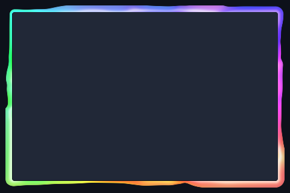

# Rainbow

A glossy rainbow ripple around the window edge.



Preview rendered from this shader over a synthetic desktop sample; it is not a screenshot of a running session. It shows the outer shader only; paired inner overlays and compositor light are not shown.

## Use

Follow the [installation instructions](../../README.md#install), then merge this into `~/.config/umbriel/config.toml`:

```toml
[include]
files = ["shaders/community/border/rainbow/effect.toml"]

[effects]
border = "rainbow"
```

Append the include path to your existing `files` array and merge selectors into existing tables. Including `effect.toml` defines the preset; the selector enables it. [`config.toml`](config.toml) contains the same copyable example.

This preset automatically includes [rainbow-overlay](../../window/rainbow-overlay/). Keep that directory too if copying individual effects. Do not include it separately. The overlay follows the focused border; it is not applied to every window.

Borders apply to the focused, decorated window. Fullscreen and urgent windows do not display the border effect. The `ring_padding` constant in the shader must match `padding` in `effect.toml`.

## Colours and tuning

Colours are defined in `shader.glsl`. Setting `palette = true` alone will not recolour a shader that does not read the palette. Edit its colour constants to customise it.

## Compatibility and cost

Requires Umbriel with the preset effects API introduced in [`512e2fb3`](https://github.com/noctalia-dev/umbriel/commit/512e2fb3). See [validation and limitations](../../VALIDATION.md). No previous-frame feedback buffers are used. This adds a focused-border pass. No performance benchmark is claimed.

## Attribution

Author/contributor: Barrulus. License: [MIT](../../LICENSES/Barrulus-MIT.txt).

Contributed by Barrulus on 2026-09-27.
