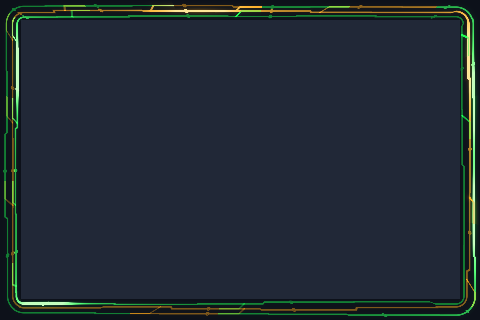

# Sentient Runner

Green-and-gold circuit tracks with branching links and moving packets.



Preview rendered from this shader over a synthetic desktop sample; it is not a screenshot of a running session. It shows the outer shader only; paired inner overlays and compositor light are not shown.

## Use

Download [effect.toml](effect.toml) and [shader.glsl](shader.glsl) using GitHub’s **Download raw file** button and save them together in `~/.config/umbriel/shaders/community/border/sentient-runner/`. Keep the license notice linked below with your files. See [installation](../../README.md#install) for details.

Then merge this into `~/.config/umbriel/config.toml`:

```toml
[include]
files = ["shaders/community/border/sentient-runner/effect.toml"]

[effects]
border = "sentient-runner"
```

Append the include path to your existing `files` array and merge selectors into existing tables. Including `effect.toml` defines the preset; the selector enables it. [`config.toml`](config.toml) contains the same copyable example.

Borders apply to the focused, decorated window. Fullscreen and urgent windows do not display the border effect. The `ring_padding` constant in the shader must match `padding` in `effect.toml`.

## Colours and tuning

Colours are defined in `shader.glsl`. Setting `palette = true` alone will not recolour a shader that does not read the palette. Edit its colour constants to customise it.

## Compatibility and cost

Requires Umbriel with the preset effects API introduced in [`512e2fb3`](https://github.com/noctalia-dev/umbriel/commit/512e2fb3). See [validation and limitations](../../VALIDATION.md). No previous-frame feedback buffers are used. This adds a focused-border pass. The shader contains loops; performance depends on your GPU and the affected area. No performance benchmark is claimed.

## Attribution

Author/contributor: Barrulus. License: [MIT](../../LICENSES/Barrulus-MIT.txt).

Contributed by Barrulus on 2026-09-27.
