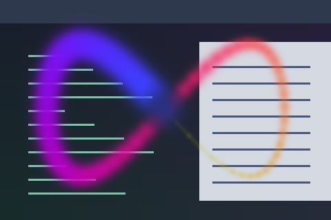

# Comet

A curved rainbow comet with a two-second fading tail and smoothly blended crossings.



Preview rendered with fallback rainbow colours over synthetic desktop content and a crossing pointer path; not a live session screenshot.

## Use

Save [effect.toml](effect.toml) and [shader.glsl](shader.glsl) together in `~/.config/umbriel/shaders/community/cursor/comet/`, retaining the license notices below. Merge this example into your configuration:

```toml
[include]
files = ["shaders/community/cursor/comet/effect.toml"]

[effects]
cursor = "cursor.comet"
```

Append the include path to the existing `files` array and merge selectors into existing tables. Including the preset defines it; the selector enables it. [config.toml](config.toml) contains this example. See [installation](../../README.md#install).

## Tuning

`kLife = 2.0` controls fade duration in seconds; `kMaxWidth = 20.0` controls head width in logical pixels. Segment opacity is `coverage * 0.9`.

`palette = true` in `effect.toml` cycles through theme colours along the tail. Set it to `false` for the original rainbow colours shown in the preview. The rainbow is also used when no theme palette is available.

Both the ribbon and any overlapping segments are softened near the pointer to keep text readable. `headStrength` retains 40% strength within 12 logical pixels, smoothly reaching full strength at 52 pixels. Edit these GLSL values to adjust the clear area. The preset's `radius = 72` pads the pointer path; increase it when enlarging the artwork to avoid clipping.

Save and reload; see [reloading edits](../../README.md#reloading-edits).

## Compatibility and cost

Requires the newer cursor pointer-history API: `umbriel_pointer_count` and `umbriel_pointer_path[64]`, with samples ordered oldest to newest and containing UV position, age and birth time. The original preset-effects API alone is insufficient. Uses the current rectangle's `umbriel_pointer` and logical `umbriel_size`.

Processes up to 64 motion samples per pixel over the affected path area. No previous-frame feedback buffers are used. Cost depends on path length, shaded area and GPU; no performance benchmark is claimed. See [validation](../../VALIDATION.md).

## Attribution

Barrulus; curve implementation adapted from Umbriel’s bundled trail-path shader by Noctalia. Licenses: [Barrulus MIT](../../LICENSES/Barrulus-MIT.txt) and [Noctalia MIT](../../LICENSES/Noctalia-MIT.txt).

Contributed on 2026-10-05.
