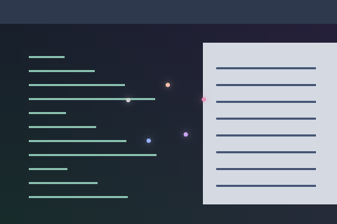

# Cursor Sparkle

Five theme-coloured dots orbit the pointer at a wavering distance.



Preview rendered from this shader over a synthetic desktop sample; it is not a screenshot of a running session.

## Use

Follow the [installation instructions](../../README.md#install), then merge this into `~/.config/umbriel/config.toml`:

```toml
[include]
files = ["shaders/community/cursor/cursor-sparkle/effect.toml"]

[effects]
cursor = "cursor-sparkle"
```

Append the include path to your existing `files` array and merge selectors into existing tables. Including `effect.toml` defines the preset; the selector enables it. [`config.toml`](config.toml) contains the same copyable example.

The preset uses `radius = 96` logical pixels around the pointer.

## Colours and tuning

This preset enables the theme palette. Edit `[colors]` to change the supplied colours; see [theme colours](../../README.md#theme-colours).

## Compatibility and cost

Requires upstream Umbriel with the preset effects API introduced in [`512e2fb3`](https://github.com/noctalia-dev/umbriel/commit/512e2fb3). See [validation and limitations](../../VALIDATION.md). No previous-frame feedback buffers are used. This adds a pass over its affected output area and prevents direct scanout while active. The shader contains loops; performance depends on your GPU and the affected area. No performance benchmark is claimed.

## Attribution

Author/contributor: Barrulus. License: [MIT](../../LICENSES/Barrulus-MIT.txt).

Packaged from Barrulus’s active upstream Umbriel preset collection on 2026-09-27. GLSL is unchanged from the deployed copy.
