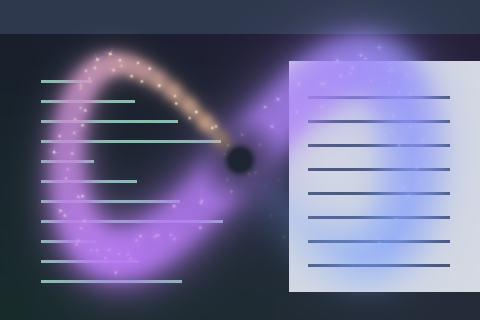

# Fairy Tail

A long multicolour cloud with drifting grains and tiny twinkling stars.



Preview rendered from this shader over synthetic desktop content and a crossing pointer path; not a live session screenshot.

## Use

Save [effect.toml](effect.toml) and [shader.glsl](shader.glsl) together in `~/.config/umbriel/shaders/community/cursor/fairy-tail/`, retaining the license notices below. Merge this example into your configuration:

```toml
[include]
files = ["shaders/community/cursor/fairy-tail/effect.toml"]

[effects]
cursor = "cursor.fairy-tail"
```

Append the include path to the existing `files` array and merge selectors into existing tables. Including the preset defines it; the selector enables it. [config.toml](config.toml) contains this example. See [installation](../../README.md#install).

## Tuning

The age fade ends at 2 seconds. `width = 8.0 + 19.0 * ...` controls the cloud width. `palette = true` uses theme accents with lavender; set it false for the blue/gold fallback colours. The existing 10–20 pixel clear area immediately around the pointer is retained.

Both the ribbon and any overlapping segments are softened near the pointer to keep text readable. `headStrength` retains 40% strength within 12 logical pixels, smoothly reaching full strength at 52 pixels. Edit these GLSL values to adjust the clear area. The preset's `radius = 112` pads the pointer path; increase it when enlarging the artwork to avoid clipping.

Save and reload; see [reloading edits](../../README.md#reloading-edits).

## Compatibility and cost

Requires the newer cursor pointer-history API: `umbriel_pointer_count` and `umbriel_pointer_path[64]`, with samples ordered oldest to newest and containing UV position, age and birth time. The original preset-effects API alone is insufficient. Uses the current rectangle's `umbriel_pointer` and logical `umbriel_size`.

Processes up to 64 motion samples per pixel over the affected path area. No previous-frame feedback buffers are used. Cost depends on path length, shaded area and GPU; no performance benchmark is claimed. See [validation](../../VALIDATION.md).

## Attribution

Barrulus. License: [MIT](../../LICENSES/Barrulus-MIT.txt).

Contributed on 2026-10-05.
