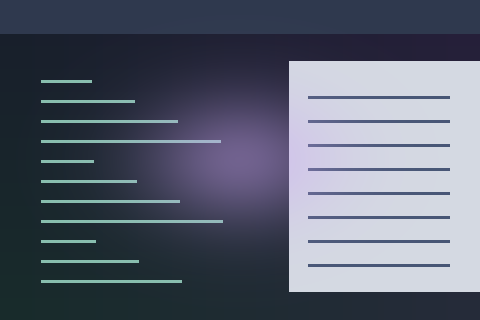

# Glow

A soft theme-accent halo around the pointer.



Preview rendered from this shader over a synthetic desktop sample; it is not a screenshot of a running session.

## Use

Download [effect.toml](effect.toml) and [shader.glsl](shader.glsl) using GitHub’s **Download raw file** button and save them together in `~/.config/umbriel/shaders/community/cursor/glow/`. Keep the license notice linked below with your files. See [installation](../../README.md#install) for details.

Then merge this into `~/.config/umbriel/config.toml`:

```toml
[include]
files = ["shaders/community/cursor/glow/effect.toml"]

[effects]
cursor = "glow"
```

Append the include path to your existing `files` array and merge selectors into existing tables. Including `effect.toml` defines the preset; the selector enables it. [`config.toml`](config.toml) contains the same copyable example.

The preset uses `radius = 96` logical pixels around the pointer.

## Configuration options

Edit the existing `[effects.preset."glow"]` table in [effect.toml](effect.toml).
The [complete configuration reference](../../README.md#configuration-reference) explains
selection, overrides, and accepted ranges. The values below are this preset's shipped
settings, including defaults for omitted keys.

| TOML setting | Shipped value | What changing it does |
| --- | --- | --- |
| `kind` | `"cursor"` | Keep this kind: the source implements its `cursor` entry point. |
| `shader` | `"shader.glsl"` | Loads the source beside this preset; change the path only when using another compatible source. |
| `palette` | `true` | Supplies theme colours. Disable it to use the shader's fallback colour; see the colour controls below. |
| `radius` | `96` | Half-size in logical pixels of the shaded square; 0 shades the whole output. This shader uses rectangle-normalised coordinates, so changing radius also changes halo size. |

There is no TOML `speed`, `animated`, or `opacity` setting for this kind.
Motion/strength changes are GLSL edits below.
Global `[effects] max_fps` limits effect-driven frames, and `in_capture`
controls inclusion in screencopy/image-copy captures. Neither resizes the artwork.

### Shader controls

Edit these values in [shader.glsl](shader.glsl), not in TOML. `#define` is
active GLSL code; comments use `//` or `/* ... */`. Start with small changes
and keep paired shaders in sync. Keep size and duration divisors positive.

| GLSL control or expression | Shipped value | Visual effect |
| --- | --- | --- |
| `halo exponent` | `6.0` | Larger concentrates the halo; smaller broadens it inside the allocated rectangle. |
| `halo strength` | `0.5` | Lower gives a fainter halo. |
| `breath baseline / amplitude` | `0.75 / 0.25` | Controls average brightness and breathing depth; 0 amplitude makes brightness steady. |
| `breath frequency` | `3.0` | Larger breathes faster. |
| `fallback tint` | `vec4(0.48, 0.64, 1.0, 1.0)` | Used with palette disabled; with palette enabled edit accent_primary. |

Save and reload; see [reloading edits](../../README.md#reloading-edits).

## Compatibility and cost

Requires Umbriel with the preset effects API introduced in [`512e2fb3`](https://github.com/noctalia-dev/umbriel/commit/512e2fb3). See [validation and limitations](../../VALIDATION.md). No previous-frame feedback buffers are used. This adds a pass over its affected output area and prevents direct scanout while active. No performance benchmark is claimed.

## Attribution

Author/contributor: Noctalia. License: [MIT](../../LICENSES/Noctalia-MIT.txt).

Copied from [Umbriel’s bundled glow preset](https://github.com/noctalia-dev/umbriel/tree/c3d0eaafb1e31ee0abd99b547f85b5d52a28d0c7/examples/effects/cursor/glow).
