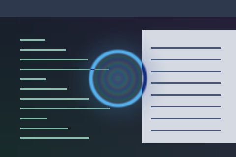

# Rainbow Tunnel

A colourful tunnel centred on the pointer, with a surrounding ring.



Preview rendered from this shader over a synthetic desktop sample; it is not a screenshot of a running session.

## Use

Follow the [installation instructions](../../README.md#install), then merge this into `~/.config/umbriel/config.toml`:

```toml
[include]
files = ["shaders/community/cursor/rainbow-tunnel/effect.toml"]

[effects]
cursor = "cursor.rainbow-tunnel"
```

Append the include path to your existing `files` array and merge selectors into existing tables. Including `effect.toml` defines the preset; the selector enables it. [`config.toml`](config.toml) contains the same copyable example.

The preset uses `radius = 0` (the whole output).

## Colours and tuning

Colours are defined in `shader.glsl`. Setting `palette = true` alone will not recolour a shader that does not read the palette. Edit its colour constants to customise it.

## Compatibility and cost

Requires upstream Umbriel with the preset effects API introduced in [`512e2fb3`](https://github.com/noctalia-dev/umbriel/commit/512e2fb3). See [validation and limitations](../../VALIDATION.md). No previous-frame feedback buffers are used. This adds a pass over its affected output area and prevents direct scanout while active. No performance benchmark is claimed.

## Attribution

Author/contributor: Barrulus. License: [MIT](../../LICENSES/Barrulus-MIT.txt).

Packaged from Barrulus’s active upstream Umbriel preset collection on 2026-09-27. GLSL is unchanged from the deployed copy.
