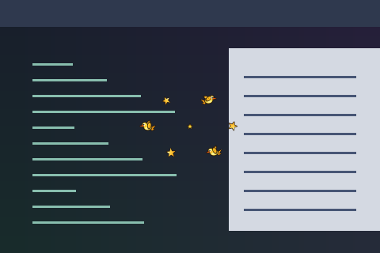

# Seeing Stars

Cartoon birds and tumbling stars circle the pointer.



Preview rendered from this shader over a synthetic desktop sample; it is not a screenshot of a running session.

## Use

Download [effect.toml](effect.toml) and [shader.glsl](shader.glsl) using GitHub’s **Download raw file** button and save them together in `~/.config/umbriel/shaders/community/cursor/seeing-stars/`. Keep the license notice linked below with your files. See [installation](../../README.md#install) for details.

Then merge this into `~/.config/umbriel/config.toml`:

```toml
[include]
files = ["shaders/community/cursor/seeing-stars/effect.toml"]

[effects]
cursor = "cursor.seeing-stars"
```

Append the include path to your existing `files` array and merge selectors into existing tables. Including `effect.toml` defines the preset; the selector enables it. [`config.toml`](config.toml) contains the same copyable example.

The preset uses `radius = 80` logical pixels around the pointer.

## Theme palette

This preset enables `palette = true` in `effect.toml`. Artwork colours follow
Umbriel's `[colors]` accents, warning, and error colours, while retaining shading
and highlights. Set `palette = false` in that preset to restore the original
colours shown in the preview. For a border with a companion overlay, change
both presets together. Shader colour constants are the fallback colours.

## Configuration options

Edit the existing `[effects.preset."cursor.seeing-stars"]` table in [effect.toml](effect.toml).
The [complete configuration reference](../../README.md#configuration-reference) explains
selection, overrides, and accepted ranges. The values below are this preset's shipped
settings, including defaults for omitted keys.

| TOML setting | Shipped value | What changing it does |
| --- | --- | --- |
| `kind` | `"cursor"` | Keep this kind: the source implements its `cursor` entry point. |
| `shader` | `"shader.glsl"` | Loads the source beside this preset; change the path only when using another compatible source. |
| `palette` | `true` | Use theme colours for artwork. Set false to restore the original shader colours. |
| `radius` | `80` | Half-size in logical pixels of the shaded square; 0 shades the whole output. This bounds drawing, not the artwork size; reducing it may clip the effect. Use the GLSL size controls below to resize it. |

There is no TOML `speed`, `animated`, or `opacity` setting for this kind.
Motion/strength changes are GLSL edits below.
Global `[effects] max_fps` limits effect-driven frames, and `in_capture`
controls inclusion in screencopy/image-copy captures. Neither resizes the artwork.

### Shader controls

Edit these values in [shader.glsl](shader.glsl), not in TOML. `#define` is
active GLSL code; comments use `//` or `/* ... */`. Start with small changes
and keep paired shaders in sync. Keep size and duration divisors positive.

| GLSL control or expression | Shipped value | Visual effect |
| --- | --- | --- |
| `orbit axes` | `54.0, 39.0` | Ellipse radii in logical pixels; lower both for a smaller orbit. |
| `orbit speed` | `1.15` | Larger moves birds/stars faster. |
| `flap frequency` | `13.0` | Larger flaps wings faster. |
| `star radius` | `5.4 + 0.5 * sin(...)` | Mean star size and pulsation in logical pixels; lower makes smaller stars. |
| `local cull` | `16.0` | Drawing cutoff around each sprite; if enlarging sprites, increase this and TOML radius as needed. |

Save and reload; see [reloading edits](../../README.md#reloading-edits).

## Compatibility and cost

Requires Umbriel with the preset effects API introduced in [`512e2fb3`](https://github.com/noctalia-dev/umbriel/commit/512e2fb3). See [validation and limitations](../../VALIDATION.md). No previous-frame feedback buffers are used. This adds a pass over its affected output area and prevents direct scanout while active. The shader contains loops; performance depends on your GPU and the affected area. No performance benchmark is claimed.

## Attribution

Author/contributor: Barrulus. License: [MIT](../../LICENSES/Barrulus-MIT.txt).

Contributed by Barrulus on 2026-09-27.
