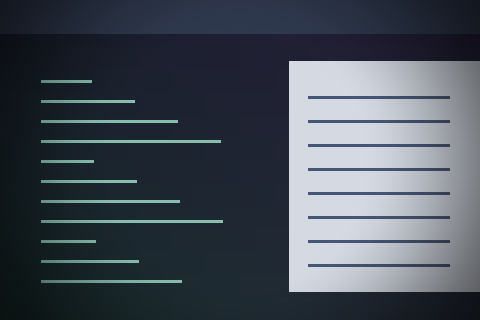

# Spotlight

A spotlight centred on the pointer shades the rest of the output.



Preview rendered from this shader over a synthetic desktop sample; it is not a screenshot of a running session.

## Use

Download [effect.toml](effect.toml) and [shader.glsl](shader.glsl) using GitHub’s **Download raw file** button and save them together in `~/.config/umbriel/shaders/community/cursor/spotlight/`. Keep the license notice linked below with your files. See [installation](../../README.md#install) for details.

Then merge this into `~/.config/umbriel/config.toml`:

```toml
[include]
files = ["shaders/community/cursor/spotlight/effect.toml"]

[effects]
cursor = "cursor.spotlight"
```

Append the include path to your existing `files` array and merge selectors into existing tables. Including `effect.toml` defines the preset; the selector enables it. [`config.toml`](config.toml) contains the same copyable example.

The preset uses `radius = 0` (the whole output).

## Configuration options

Edit the existing `[effects.preset."cursor.spotlight"]` table in [effect.toml](effect.toml).
The [complete configuration reference](../../README.md#configuration-reference) explains
selection, overrides, and accepted ranges. The values below are this preset's shipped
settings, including defaults for omitted keys.

| TOML setting | Shipped value | What changing it does |
| --- | --- | --- |
| `kind` | `"cursor"` | Keep this kind: the source implements its `cursor` entry point. |
| `shader` | `"shader.glsl"` | Loads the source beside this preset; change the path only when using another compatible source. |
| `palette` | `false` | This source does not read the palette; enabling it alone does not recolour the effect. |
| `radius` | `0` | Half-size in logical pixels of the shaded square; 0 shades the whole output. This bounds drawing, not the artwork size; reducing it may clip the effect. Use the GLSL size controls below to resize it. |

There is no TOML `speed`, `animated`, or `opacity` setting for this kind.
This shader is static; changing the frame cap does not animate it.
Global `[effects] max_fps` limits effect-driven frames, and `in_capture`
controls inclusion in screencopy/image-copy captures. Neither resizes the artwork.

### Shader controls

Edit these values in [shader.glsl](shader.glsl), not in TOML. `#define` is
active GLSL code; comments use `//` or `/* ... */`. Start with small changes
and keep paired shaders in sync. Keep size and duration divisors positive.

| GLSL control or expression | Shipped value | Visual effect |
| --- | --- | --- |
| `outer / inner falloff` | `320.0 / 120.0` | Buffer-pixel distances around the pointer; lower both for a smaller spotlight, keeping outer greater than inner. |
| `outside brightness` | `0.35` | Multiplier outside the spotlight, 0–1; lower dims more, 1 removes dimming. Keep radius = 0 to dim the whole output. |

Save and reload; see [reloading edits](../../README.md#reloading-edits).

## Compatibility and cost

Requires Umbriel with the preset effects API introduced in [`512e2fb3`](https://github.com/noctalia-dev/umbriel/commit/512e2fb3). See [validation and limitations](../../VALIDATION.md). No previous-frame feedback buffers are used. This adds a pass over its affected output area and prevents direct scanout while active. No performance benchmark is claimed.

## Attribution

Author/contributor: Barrulus. License: [MIT](../../LICENSES/Barrulus-MIT.txt).

Contributed by Barrulus on 2026-09-27.
