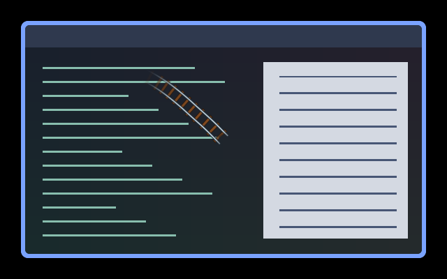

# Train Tracks

Two steel rails and wooden sleepers follow the pointer's curves, as though a
little train just passed through. Only the last 150 logical pixels of track are
visible, fading out within 0.45 seconds to keep text readable. The pointer image
is unchanged.



[Animated preview](preview.gif)

The preview is a private headless Umbriel capture over synthetic light and dark
content with a figure-eight pointer path, not a personal desktop screenshot.

## Use

Save [effect.toml](effect.toml) and [shader.glsl](shader.glsl) together in
`~/.config/umbriel/shaders/community/cursor/train-tracks/`, retaining the license
notices below. Merge [config.toml](config.toml) into your configuration:

```toml
[include]
files = ["shaders/community/cursor/train-tracks/effect.toml"]

[effects]
cursor = "cursor.train-tracks"
```

Append to existing include lists and merge existing tables. Including the preset
registers it; selecting it enables it. See [installation](../../README.md#install).

## Configuration options

Edit the constants at the top of `shader.glsl`:

| Constant | Default | Meaning |
| --- | --- | --- |
| `TRACK_LIFE` | `0.45` | Fade duration in seconds; try 0.2–0.6 for a brief trail. |
| `MAX_TRACK_LENGTH` | `150.0` | Maximum length along the curved path, in logical pixels; try 60–200. |
| `HALF_GAUGE` | `8.0` | Half the distance between rails, in logical pixels. |
| `SLEEPER_SPACING` | `14.0` | Approximate spacing of wooden sleepers, in logical pixels. |
| `SLEEPER_HALF_LENGTH` | `12.0` | Half the sleeper length across the rails. Keep larger than `HALF_GAUGE + 2`. |
| `OPACITY` | `0.95` | Overall artwork opacity, from 0 to 1. |

Rails have dark edges and silver centres; sleepers have dark edges and brown
insets. Colours are independent of the theme. Artwork clears the first three
pixels around the pointer, reaching full strength at twelve pixels. The preset's
`radius = 48` pads the path; increase it if substantially widening the track.
The final 40% of the path fades smoothly, and age fading starts after 0.045
seconds. Fast movement cannot extend the trail beyond the length cap.

Save to reload; see [reloading edits](../../README.md#reloading-edits).

## Compatibility and cost

Requires the newer `umbriel_pointer_count` / `umbriel_pointer_path[64]` cursor
history API. Uses sample age rather than a continuous clock, and no previous-frame
feedback buffers. Stationary or expired history draws nothing; jumps longer than
800 logical pixels are skipped.

Up to 63 curved segments are processed per pixel, newest first, stopping at the
length or age limit, with distance rejection and six subdivisions. The compositor
still retains two seconds of history, so long sweeps can increase the affected
rectangle and cost despite the shorter visible trail. Sleepers are spaced per
history segment, so spacing varies with sampling and speed; they do not use a
scrolling phase. Very tight bends or reversals can fold the rails, and crossings
overlay rails above sleepers without modelling railway switches. No hardware
performance benchmark is claimed. See [validation](../../VALIDATION.md).

## Attribution

Barrulus. Time-aware curve interpolation adapted from [Comet](../comet/) and
Noctalia's bundled trail-path shader. Licenses: [Barrulus MIT](../../LICENSES/Barrulus-MIT.txt)
and [Noctalia MIT](../../LICENSES/Noctalia-MIT.txt).

Contributed on 2026-10-10.
