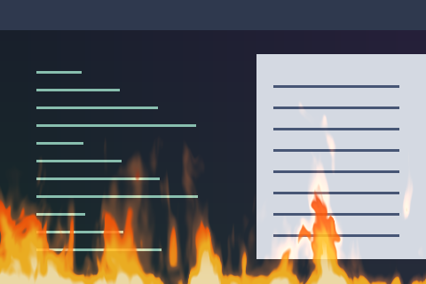

# Fire Tendrils

Moving fire tendrils over the window.



Preview rendered from this shader over a synthetic desktop sample; it is not a screenshot of a running session.

## Use

Download [effect.toml](effect.toml) and [shader.glsl](shader.glsl) using GitHub’s **Download raw file** button and save them together in `~/.config/umbriel/shaders/community/window/fire-tendrils/`. Keep the license notice linked below with your files. See [installation](../../README.md#install) for details.

Then merge this into `~/.config/umbriel/config.toml`:

```toml
[include]
files = ["shaders/community/window/fire-tendrils/effect.toml"]

[effects]
window = "window.fire-tendrils"
```

Append the include path to your existing `files` array and merge selectors into existing tables. Including `effect.toml` defines the preset; the selector enables it. [`config.toml`](config.toml) contains the same copyable example.

## Configuration options

Edit the existing `[effects.preset."window.fire-tendrils"]` table in [effect.toml](effect.toml).
The [complete configuration reference](../../README.md#configuration-reference) explains
selection, overrides, and accepted ranges. The values below are this preset's shipped
settings, including defaults for omitted keys.

| TOML setting | Shipped value | What changing it does |
| --- | --- | --- |
| `kind` | `"window"` | Keep this kind: the source implements its `window` entry point. |
| `shader` | `"shader.glsl"` | Loads the source beside this preset; change the path only when using another compatible source. |
| `palette` | `false` | This source does not read the palette; enabling it alone does not recolour the effect. |

There is no TOML `speed`, `animated`, or `opacity` setting for this kind.
Motion/strength changes are GLSL edits below.
Global `[effects] max_fps` limits effect-driven frames, and `in_capture`
controls inclusion in screencopy/image-copy captures. Neither resizes the artwork.

### Shader controls

Edit these values in [shader.glsl](shader.glsl), not in TOML. `#define` is
active GLSL code; comments use `//` or `/* ... */`. Start with small changes
and keep paired shaders in sync. Keep size and duration divisors positive.

| GLSL control or expression | Shipped value | Visual effect |
| --- | --- | --- |
| `FLAME_HEIGHT` | `0.40` | Main flame height as a fraction of window height; larger reaches higher. Detached tips can rise beyond that height. |
| `THRESH` | `0.40` | Noise threshold for fire; higher leaves less of the field burning. |
| `SLOPE` | `0.36` | How quickly fire thins with height; higher makes shorter, more broken flames. |
| `WARP` | `2.0` | Tendril distortion; 0 gives rounded noise blobs, larger makes more stretched, pinching tongues. |
| `EDGE` | `0.022` | Softness of the boundary; smaller positive values make sharper edges. |
| `XFREQ` | `10.0` | Horizontal noise frequency; larger makes narrower flame tongues. |
| `YFREQ` | `3.4` | Vertical noise frequency; smaller relative to XFREQ makes taller, stretched tongues. |
| `RISE` | `1.6` | Upward motion rate; larger positive values rise faster. |
| `BREAK` | `0.17` | Fine roughness at flame tips; larger makes more ragged edges. |
| `OPACITY` | `0.85` | Opacity of the decoration over content; lower is more transparent. Keep between 0 and 1. |
| `GLOW` | `0.35` | Glow strength; lower reduces the luminous highlight. |

Save and reload; see [reloading edits](../../README.md#reloading-edits).

## Compatibility and cost

Requires Umbriel with the preset effects API introduced in [`512e2fb3`](https://github.com/noctalia-dev/umbriel/commit/512e2fb3). See [validation and limitations](../../VALIDATION.md). No previous-frame feedback buffers are used. This adds a pass per affected window; applying it globally increases the cost with the number and size of visible windows. The shader contains loops; performance depends on your GPU and the affected area. No performance benchmark is claimed.

## Attribution

Author/contributor: Barrulus. License: [MIT](../../LICENSES/Barrulus-MIT.txt).

Contributed by Barrulus on 2026-09-27.
