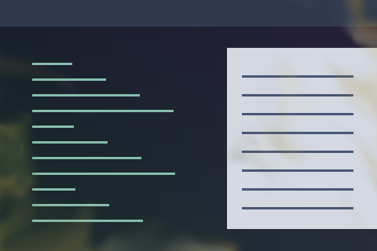

# Prairie Wind

An animated prairie-wind treatment of the window image.



Preview rendered from this shader over a synthetic desktop sample; it is not a screenshot of a running session.

## Use

Download [effect.toml](effect.toml) and [shader.glsl](shader.glsl) using GitHub’s **Download raw file** button and save them together in `~/.config/umbriel/shaders/community/window/prairie-wind/`. Keep the license notice linked below with your files. See [installation](../../README.md#install) for details.

Then merge this into `~/.config/umbriel/config.toml`:

```toml
[include]
files = ["shaders/community/window/prairie-wind/effect.toml"]

[effects]
window = "window.prairie-wind"
```

Append the include path to your existing `files` array and merge selectors into existing tables. Including `effect.toml` defines the preset; the selector enables it. [`config.toml`](config.toml) contains the same copyable example.

## Theme palette

This preset enables `palette = true` in `effect.toml`. Artwork colours follow
Umbriel's `[colors]` accents, warning, and error colours, while retaining shading
and highlights. Set `palette = false` in that preset to restore the original
colours shown in the preview. For a border with a companion overlay, change
both presets together. Shader colour constants are the fallback colours.

## Configuration options

Edit the existing `[effects.preset."window.prairie-wind"]` table in [effect.toml](effect.toml).
The [complete configuration reference](../../README.md#configuration-reference) explains
selection, overrides, and accepted ranges. The values below are this preset's shipped
settings, including defaults for omitted keys.

| TOML setting | Shipped value | What changing it does |
| --- | --- | --- |
| `kind` | `"window"` | Keep this kind: the source implements its `window` entry point. |
| `shader` | `"shader.glsl"` | Loads the source beside this preset; change the path only when using another compatible source. |
| `palette` | `true` | Use theme colours for artwork. Set false to restore the original shader colours. |

There is no TOML `speed`, `animated`, or `opacity` setting for this kind.
Motion/strength changes are GLSL edits below.
Global `[effects] max_fps` limits effect-driven frames, and `in_capture`
controls inclusion in screencopy/image-copy captures. Neither resizes the artwork.

### Shader controls

Edit these values in [shader.glsl](shader.glsl), not in TOML. `#define` is
active GLSL code; comments use `//` or `/* ... */`. Start with small changes
and keep paired shaders in sync. Keep size and duration divisors positive.

| GLSL control or expression | Shipped value | Visual effect |
| --- | --- | --- |
| `SWEEP` | `0.28` | Travel speed of wind fronts; larger positive values move faster. |
| `STRENGTH` | `0.35` | Strength of the visual treatment; lower makes it subtler. |
| `SHEEN` | `0.12` | Pale leading-edge flash strength; lower reduces the flash. |
| `SHADE` | `0.07` | Darkening in gust troughs; lower reduces the shaded contrast. |
| `SCALE` | `1.0` | Spatial frequency; larger values make smaller, more numerous features. Keep positive. |
| `WANDER` | `1.4` | Deviation from WIND; lower gives a steadier direction. |
| `WIND` | `vec2(0.966, 0.259)` | Mean wind direction as a unit vector; change its components to steer the gusts. |

Save and reload; see [reloading edits](../../README.md#reloading-edits).

## Compatibility and cost

Requires Umbriel with the preset effects API introduced in [`512e2fb3`](https://github.com/noctalia-dev/umbriel/commit/512e2fb3). See [validation and limitations](../../VALIDATION.md). No previous-frame feedback buffers are used. This adds a pass per affected window; applying it globally increases the cost with the number and size of visible windows. The shader contains loops; performance depends on your GPU and the affected area. No performance benchmark is claimed.

## Attribution

Author/contributor: Barrulus. License: [MIT](../../LICENSES/Barrulus-MIT.txt).

Contributed by Barrulus on 2026-09-27.
